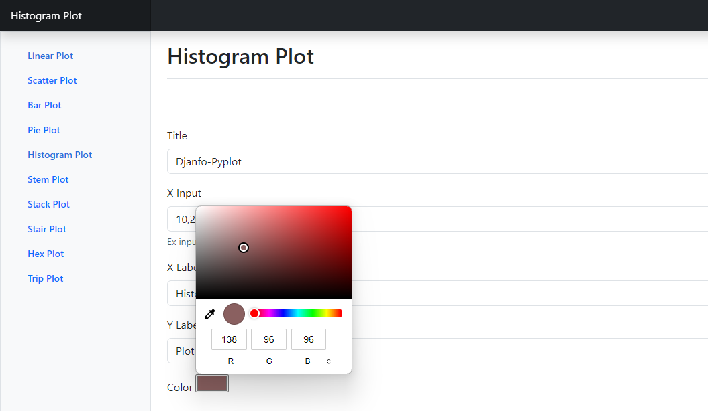

# Django-Pyplot

Effortlessly create various types of Matplotlib graphs without coding! Django-Pyplot is a web application developed with Django and Matplotlib, allowing users to plot graphs by simply entering data. From bar charts to scatter plots, visualize your data interactively.

## Features

- **Graph Variety**: Plot bar charts, line graphs, scatter plots, and more with ease.
- **User-Friendly Interface**: No coding required; simply input your data for instant visualizations.
- **Django Integration**: Built on Django for a robust and scalable web application.
- **Matplotlib Magic**: Leverage the power of Matplotlib to generate high-quality graphs.

## How to Use

1. Clone the repository: `git clone https://github.com/Raahim2/Django-Pyplot/.git`
2. Install dependencies: `pip install -r requirements.txt`
3. Run the Django development server: `python manage.py runserver`
4. Access the application in your browser at `http://127.0.0.1:8000/`

## Graph Examples

- Bar Chart
- Line Graph
- Scatter Plot
- Pie Chart

## Preview

## Contribution

Contributions are welcome! Feel free to open issues or submit pull requests to enhance functionality or add new graph types.

## License

This project is licensed under the [MIT License](LICENSE).

Explore Django-Pyplot and start visualizing your data effortlessly!

---

*Django-Pyplot - Simplifying Data Visualization with Django and Matplotlib*
